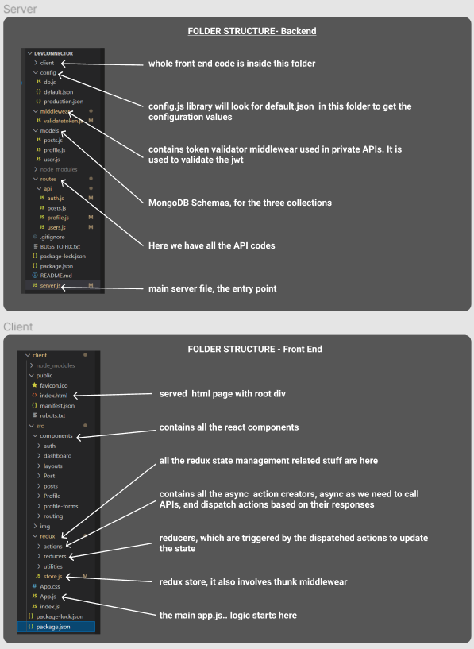

# devConnector_MERN

Click to Visit LIVE Hosted Site SITE --> :  https://lit-wave-98591.herokuapp.com/

(Hosted using free tier of heroku, might be slower when launching for the first time if dyno is sleeping. Also if the monthly quota has expired the app wont launch)

Repo for my dev connector project (MERN)

Still working on it

# Steps to setup : -

1. Clone the repo
2. Run npm i in both outer level (for the server) and inside the client folder
3. Inside it run npm run runBoth, this will launch both backend server and font end end using concurrently

This is branch has the final code, with the new UI, and this is the one i pushed to heroku

# Preview 

# Folder Structure
